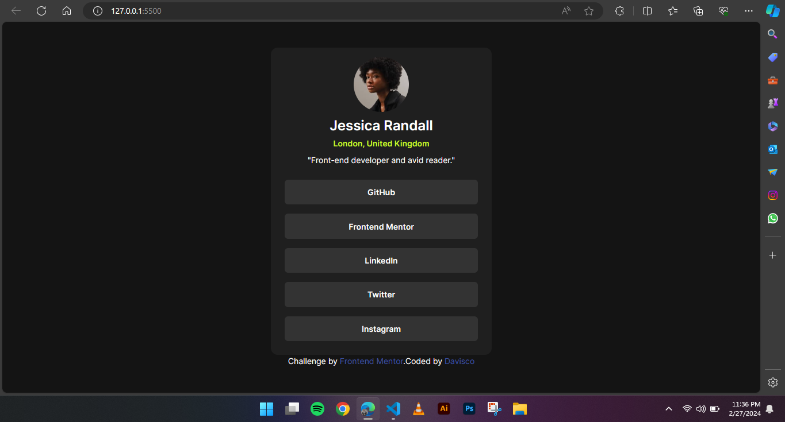

# Social Link Profile

## Overview
The "Profile Card Component" project is a front-end coding challenge designed to test and improve my skills in responsive web design and modern CSS frameworks, specifically Tailwind CSS. The challenge was to build out a profile card component and get it looking as close to the design as possible, ensuring that the component is responsive and functional across all devices.

The primary objectives were to:
Implement a design as provided in the challenge brief, ensuring the component is visually appealing and matches the design specification across various screen sizes.
Utilize Tailwind CSS for styling to leverage its utility-first approach for a faster and more efficient development process.
Ensure that the profile card is accessible and performs well on a wide range of devices, emphasizing mobile-first design principles.
This project was an opportunity to practice implementing a design with precision, using a CSS framework in a real-world scenario, and focusing on responsive and accessible design. The use of Tailwind CSS aimed to streamline the styling process, allowing for rapid development without sacrificing the quality or responsiveness of the final product.

Goals
Accurately translate a design mockup into a functional web component.
Practice and enhance my understanding of Tailwind CSS, focusing on its utility classes to manage layout, spacing, typography, and responsiveness.
Develop the component with a mobile-first approach, ensuring that it looks great and functions well on mobile devices, tablets, and desktops.
Apply best practices for web accessibility to ensure that the profile card is usable by as many people as possible.

### The challenge
Users should be able to:
- View the optimal layout for the site depending on their device's screen size
- See hover states for all interactive elements on the page

### Screenshot

### Links

- Solution URL: [Soluton](https://github.com/Dhavisco/social-links-profile)
- Live Site URL: [Live Site](https://dhavisco.github.io/social-links-profile/)

### Built with
- Semantic HTML5 markup
- CSS custom properties
- Flexbox
- CSS Grid
- Mobile-first workflow
- [React](https://reactjs.org/) - JS library
- [Tailwind CSS](https://tailwindcss.com/) - For styles

